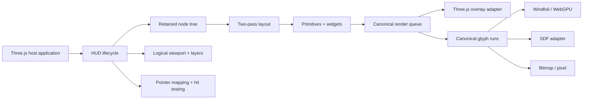

# Three HUD

**Working identifier:** `three-hud`  
**Package name:** `@scope/three-hud`. If you publish, replace the `@scope` placeholder.  
**Status:** v0.1 code exists in this workspace. Public publish is blocked. `releaseReady` is false.

Three HUD is a retained-mode HUD library for vanilla Three.js. It draws game UI inside the Three.js canvas: text, bars, gauges, inventories, hotbars, crosshairs, panels, and icons.

The package does not recreate HTML or CSS. It does not own the host frame loop. It does not require React.

v0.1 has three text paths:

- **Windfoil** — experimental analytic text on native WebGPU.
- **SDF** — smooth text for the compatibility path.
- **Bitmap** — pixel text and icon atlases at declared sizes and integer scales.

## Start here

1. Read `RESUMEN_EJECUTIVO_ES.md` for a Spanish summary.
2. Read `docs/product/PRODUCT_SPEC.md` for product scope.
3. Read `docs/api/GETTING_STARTED.md` to host a HUD overlay.
4. Read `docs/api/KNOWN_LIMITATIONS.md` for v0.1 limits and rollback.
5. Open `architecture-explorer.html` for the ticket and architecture dashboard.
6. Run the playground with the command below.

## Run the playground

```bash
pnpm install
pnpm --filter @three-hud/playground dev --host 127.0.0.1 --port 4174
```

Open `http://127.0.0.1:4174/`. Add `/?webgpu=1` for the WebGPU renderer path.

## Shape



The host owns the renderer, canvas, clock, game state, and loop. The HUD owns only resources that it creates or that the host transfers to it.

## Workspace

- one publishable ESM package in `packages/three-hud`
- optional text backends on subpath exports
- one vanilla playground that uses public package names
- one packed external-consumer fixture
- browser tests and visual labs
- architecture, package, compatibility, memory, and release gates

## Package exports

```text
@scope/three-hud
@scope/three-hud/text/windfoil
@scope/three-hud/text/sdf
@scope/three-hud/text/bitmap
@scope/three-hud/testing
```

The main entry must not import optional backend code, font parsers, workers, or browser globals at module evaluation.

## Commands

```bash
pnpm install
pnpm run validate:fast
pnpm run validate:full
pnpm run validate:release
```

Run `pnpm run validate:fast` before a normal closeout.  
Run `pnpm run validate:full` for renderer, text, or milestone work.  
If `releaseReady` is false, do not treat `pnpm run validate:release` as green.

## Font policy

This repository does not bundle third-party font binaries. The host supplies fonts, or a licensed fixture supplies them. Each redistributed font needs a provenance and license record.

## Program size

- 12 epics
- 6 evidence milestones
- 73 tickets
- 16 architecture decisions

Ticket briefs live in `planning/tickets/`. Live status belongs in GitHub when that tracker is connected.
