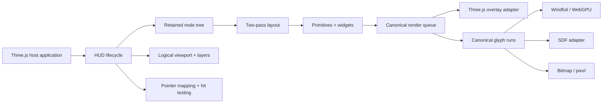

# Three HUD — architecture and execution blueprint

**Working identifier:** `three-hud`  
**Planned package:** `@scope/three-hud` — replace the placeholder scope before publication.  
**Status:** complete v0.1 specification, architecture, ticket program, and implementation-ready repository skeleton. The renderer and widgets are intentionally not claimed as implemented yet.

Three HUD is a retained-mode, canvas-native HUD/UI library for vanilla Three.js. It is designed for game interfaces rendered inside the Three.js canvas: text, progress bars, radial meters, gauges, inventories, hotbars, crosshairs, panels, icons, and compact interactive overlays.

The v0.1 architecture supports three pluggable text paths:

- **Windfoil analytic text** for high-quality WebGPU outline rendering, gated behind a feasibility decision.
- **SDF text** as the compatibility-oriented smooth-text baseline.
- **Bitmap text** for pixel-perfect typography and icon atlases at declared native sizes and integer scales.

The package does not recreate HTML/CSS, own the host frame loop, or require React.

## Start here

1. `RESUMEN_EJECUTIVO_ES.md` — Spanish executive summary.
2. `THREE_HUD_MASTER_SPEC.md` — consolidated architecture and 73-ticket table.
3. `docs/product/PRODUCT_SPEC.md` — product scope and release definition.
4. `docs/architecture/ARCHITECTURE.md` — system shape and dependency direction.
5. `docs/architecture/PUBLIC_API.md` — proposed public API.
6. `docs/adrs/` — bounded architecture decisions.
7. `planning/BACKLOG.md` — construction order.
8. `planning/tickets/` — 73 expanded v0.1 ticket briefs.
9. `architecture-explorer.html` — filterable architecture and ticket dashboard.
10. `VALIDATION_REPORT.md` — checks run and unexecuted dependency gates.

## Architectural shape



## Repository strategy

The workspace is deliberately smaller than the application's reference monorepos:

- one publishable ESM package under `packages/three-hud`;
- optional text backends exposed through subpath exports;
- one vanilla playground that consumes public exports;
- one packed external-consumer fixture;
- browser integration tests and deterministic visual labs;
- explicit architecture, package, compatibility, memory, and release gates.

This keeps v0.1 cohesive while preserving a future split into independently versioned adapters if real usage justifies it.

## Planned package exports

```text
@scope/three-hud
@scope/three-hud/text/windfoil
@scope/three-hud/text/sdf
@scope/three-hud/text/bitmap
@scope/three-hud/testing
```

The main entry must not import optional backend code, font parsers, workers, or browser globals at module evaluation.

## Development command model

```bash
pnpm install
pnpm run validate:fast
pnpm run validate:full
pnpm run validate:release
```

The supplied skeleton includes dry-run planning and boundary scripts. Implementation tickets progressively make the complete gate executable.

## Font policy

No third-party font binaries are included in this blueprint. Fonts must be supplied by the host or by separately licensed fixtures. Each redistributed font requires its own provenance and license record.

## Backlog size

- 12 epics
- 6 evidence milestones
- 73 detailed tickets
- 16 architecture decisions
- product, API, rendering, typography, layout, input, widget, quality, compatibility, legal, and release specifications
