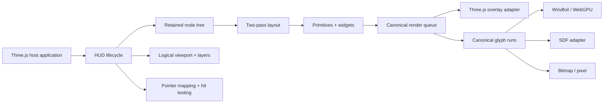

# Three HUD

**Working identifier:** `three-hud`  
**Package name:** `@scope/three-hud`. Replace the `@scope` placeholder before you publish.  
**Status:** v0.1 code exists in this workspace. Public npm publish is blocked. `releaseReady` is false.

Three HUD is a retained-mode HUD library for vanilla Three.js. It draws game UI inside the Three.js canvas: text, bars, gauges, inventories, hotbars, crosshairs, panels, and icons.

The package does not recreate HTML or CSS. It does not own the host frame loop. It does not require React.

v0.1 has three text paths:

- **Windfoil** — experimental analytic text on native WebGPU.
- **SDF** — smooth text for the compatibility path.
- **Bitmap** — pixel text and icon atlases at declared sizes and integer scales.

## Start here

1. Read [the executive summary](docs/product/EXECUTIVE_SUMMARY.md) for product intent.
2. Read [the product spec](docs/product/PRODUCT_SPEC.md) for v0.1 scope.
3. Read [getting started](docs/api/GETTING_STARTED.md) to host a HUD overlay.
4. Read [known limitations](docs/api/KNOWN_LIMITATIONS.md) for v0.1 limits and rollback.
5. Run the playground with the commands below.

## Run the playground

```bash
pnpm install
pnpm --filter @three-hud/playground dev --host 127.0.0.1 --port 4174
```

Open `http://127.0.0.1:4174/`. Add `/?webgpu=1` for the WebGPU renderer path.

The GitHub Pages site is this same playground, not a separate landing page. After the repo is public and Pages is enabled, it is at `https://gvastethecreator.github.io/threejs-hud-blueprint/`. Build it locally with:

```bash
PLAYGROUND_BASE=/threejs-hud-blueprint/ pnpm --filter @three-hud/playground build
PLAYGROUND_BASE=/threejs-hud-blueprint/ pnpm --filter @three-hud/playground exec vite preview
```

Then open `http://127.0.0.1:4174/threejs-hud-blueprint/`.

Playground keys:

- The maze walks a wireframe tour. Press `P` to pause or resume it.
- Press `W` `A` `S` `D` to move. Press `Q` `E` to turn. Hold `Shift` to sprint.
- Click the canvas to lock look. This also pauses the tour.
- Press `1` through `6` to activate a hotbar slot.
- Press `I` to invert the monochrome HUD. `T` is the torch hotbar mark, not invert.
- Press `F` to switch the `ui` font and the `pixel` font.

In VS Code, run **Dev** from the task list. Other common tasks: **Build**, **Test**, **Fast**.

## Shape



The host owns the renderer, canvas, clock, game state, and loop. The HUD owns only resources that it creates or that the host transfers to it.

## Workspace

- one publishable ESM package in `packages/three-hud`
- optional text backends on subpath exports
- one vanilla playground that uses public package names
- one packed external-consumer fixture
- browser tests and visual labs
- architecture, package, compatibility, memory, and release gates

## Package exports

```text
@scope/three-hud
@scope/three-hud/text/windfoil
@scope/three-hud/text/sdf
@scope/three-hud/text/bitmap
@scope/three-hud/testing
```

The main entry must not import optional backend code, font parsers, workers, or browser globals at module evaluation.

## Commands

```bash
pnpm install
pnpm run validate:fast
pnpm run validate:full
pnpm run validate:release
```

Run `pnpm run validate:fast` before a normal closeout.  
Run `pnpm run validate:full` for renderer, text, or milestone work.  
If `releaseReady` is false, do not treat `pnpm run validate:release` as green.

## Toolchain

These are the current pinned latest **stable** versions. Pre-release tags are not in use.

| Tool       | Pin       | Notes                                                                     |
| ---------- | --------- | ------------------------------------------------------------------------- |
| pnpm       | 12.0.0    | `packageManager` field. CI uses the same version.                         |
| Node.js    | >=22.12.0 | Engine floor.                                                             |
| TypeScript | 7.0.2     | Latest stable. 7.1 is still `next`.                                       |
| Vite       | 8.2.2     | Rolldown-backed Vite 8. Windows short-name and HMR circular-import fixes. |
| Vitest     | 5.0.0     | Stable 5.x. Pin exact; do not float to latest.                            |
| Playwright | 1.62.1    | Latest stable. 1.63 is alpha.                                             |
| oxlint     | 1.80.0    | React Compiler rule split does not apply here.                            |
| oxfmt      | 0.65.0    | Formatter pin. Default style is unchanged.                                |
| Three.js   | 0.185.1   | Peer `>=0.185.0 <0.186.0`. r186 is not published.                         |

## Font policy

This repository does not bundle third-party font binaries. The host supplies fonts, or a licensed fixture supplies them. Each redistributed font needs a provenance and license record.

## Tracker

Live work belongs in GitHub Issues and [Project 15](https://github.com/users/gvastethecreator/projects/15). Architecture decisions live in `docs/adrs/`.
