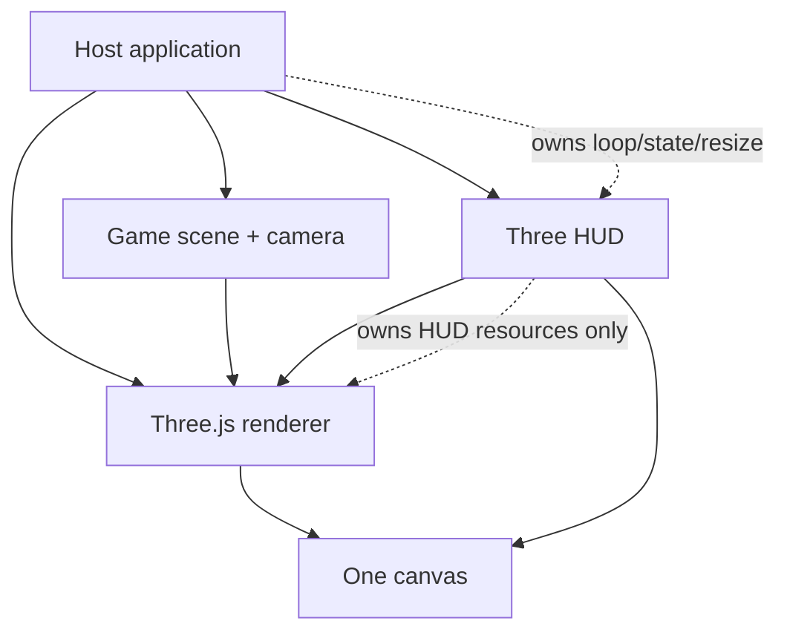
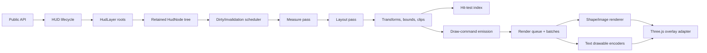
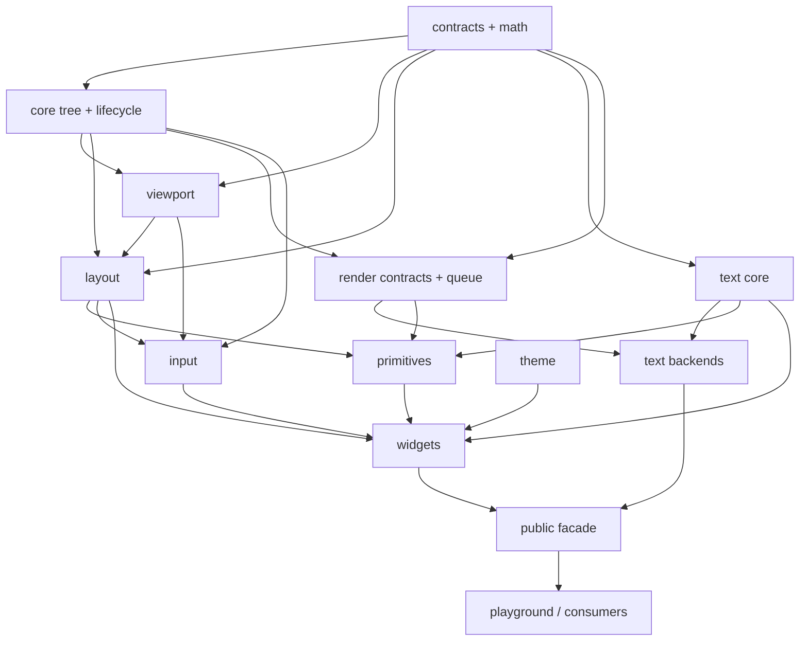
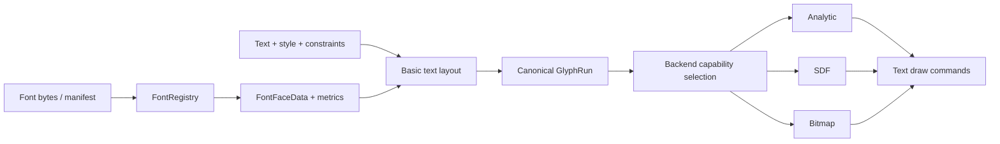

# Architecture

## 1. Architectural objective

Three HUD must feel like a small game-HUD toolkit, not a browser embedded in Three.js. The architecture separates:

- **authored semantics** — nodes, layout, text, widgets, themes, interaction;
- **canonical render intent** — draw commands, glyph runs, clips, batches;
- **renderer/backend implementation** — Three.js overlay, Windfoil, SDF, bitmap;
- **host authority** — renderer, canvas, game scene, clock, state, loop.

The retained model enables stable layout, hit testing, incremental updates, resource reuse, and debugging. Explicit backend boundaries keep the product useful even when the most ambitious text path is experimental.

## 2. System context



The host renders the game scene and then calls the HUD overlay. The HUD must not:

- create or replace the host renderer;
- call `setAnimationLoop`;
- call `requestAnimationFrame`;
- resize the canvas implicitly;
- mutate gameplay state;
- dispose borrowed renderer, texture, or host resources.

## 3. Workspace and publication boundary

```text
apps/playground            public-export consumer and visual labs
packages/three-hud         the only v0.1 publishable package
fixtures/external-consumer installs the freshly packed tarball
e2e                        browser integration and visual tests
benchmarks                 deterministic performance scenarios
docs                       product/architecture/quality truth
planning                   ticket briefs and generated indexes
scripts                    boundaries, docs, package, ticket, evidence gates
```

The workspace exists to test package boundaries; it is not an excuse to publish many packages prematurely.

### v0.1 package exports

```text
@scope/three-hud
@scope/three-hud/text/windfoil
@scope/three-hud/text/sdf
@scope/three-hud/text/bitmap
@scope/three-hud/testing
```

The main entry includes core, viewport, layout, primitives, widgets, themes, diagnostics, and backend-neutral text contracts. Optional text implementations remain lazy subpaths.

## 4. Runtime architecture



### Frame stages

1. **Host mutations:** values, text, style, hierarchy, theme, viewport.
2. **Invalidation coalescing:** dirty categories are merged.
3. **Update:**
   - resolve resources that completed asynchronously;
   - measure invalid layout/text nodes;
   - resolve layout;
   - update world transforms, bounds, effective clips;
   - update hit-test index;
   - update draw commands and instance buffers.
4. **Render:**
   - snapshot relevant host renderer state;
   - bind HUD viewport/overlay settings;
   - encode/draw ordered batches;
   - restore host state in a `finally` path.
5. **Host continues:** post-processing or next frame.
6. **Dispose when finished:** release owned resources exactly once.

The package may prepare resources asynchronously, but steady-state `update()` and `render()` should remain synchronous after readiness.

## 5. Dependency direction



Important negative dependencies:

- contracts do not import Three.js, DOM, or runtime classes;
- core does not import concrete text backends;
- widgets do not import concrete text backends;
- text backends do not import widgets or input;
- package code does not import the playground or tests;
- consumers do not deep-import package source.

## 6. Retained tree

`HudNode` is a lightweight semantic node, not necessarily a Three.js `Object3D`.

Reasons:

- layout and hit testing should not depend on Three.js scene internals;
- most UI nodes should batch into shared meshes rather than create one `Object3D` each;
- deterministic tree snapshots should omit GPU objects;
- the same widget tree can target WebGL/WebGPU and different text backends.

A node owns:

- identity and parent/children;
- local 2D transform;
- authored visibility/opacity/z-index;
- layout input and resolved boxes;
- local/world bounds;
- optional effective clip;
- interaction policy and listeners;
- dirty bits;
- optional primitive/widget behavior.

The render adapter owns a much smaller set of actual Three.js objects representing batches.

## 7. Invalidation

Dirty categories are explicit:

```text
TRANSFORM
MEASURE
LAYOUT
BOUNDS
CLIP
TEXT_LAYOUT
TEXT_RESOURCE
GEOMETRY
STYLE
HIT_TEST
RENDER_QUEUE
RESOURCE
```

Examples:

- bar value changes: style/instance, possibly label text;
- color changes: style only;
- font size changes: text layout → measure → layout → bounds → text drawable;
- child insertion: layout, bounds, hit index, queue;
- layer scale change: viewport, transforms, snapping, layout where physical policy requires it;
- opacity change: style/instance, not geometry.

Dirty reasons are bounded counters/debug records, not an unlimited history.

## 8. Viewport architecture

Each layer owns a pure `LayerViewportTransform` derived from:

- reference width/height;
- host viewport rectangle in CSS pixels;
- drawing-buffer size and DPR;
- scale mode;
- safe insets;
- HUD zoom and zoom anchor;
- pixel-snap policy.

All render, clipping, and input code uses the same transform module. More detail is in `VIEWPORT_AND_SCALING.md`.

## 9. Rendering architecture

Primitives emit canonical draw commands. Commands are sorted by:

1. layer order;
2. z-index;
3. authored stable sequence;
4. only then compatible batch grouping that does not change visual order.

A batch key may include:

- pipeline/material feature set;
- texture/atlas resource;
- blend mode;
- clip implementation key;
- backend/profile;
- sampler/filter mode.

The adapter reuses shared unit quads, instance buffers, and materials. It does not create one Three.js mesh per primitive.

## 10. Text architecture



The basic v0.1 shaper/layout path is common LTR UI text. Canonical runs retain cluster and line information so a HarfBuzz adapter can replace shaping later without replacing widgets.

Backends own glyph preparation and raster/encoding, not widget layout semantics.

## 11. Layout architecture

Layout is deliberately smaller than CSS:

- fixed, auto, fill dimensions;
- min/max;
- padding, margin, gap;
- absolute anchor/pivot;
- row/column Stack;
- fixed Grid;
- rectangular clipping.

The engine performs intrinsic measurement and final layout. It detects invalid cycles/non-convergence rather than iterating indefinitely.

## 12. Interaction architecture

The core accepts normalized pointer input; an explicit canvas adapter wires DOM Pointer Events.

Hit testing uses:

- layer order;
- render z/order contract;
- world bounds;
- effective clip;
- visibility and enabled state;
- `pointerEvents` policy.

Events follow capture → target → bubble. The host owns gameplay state; widgets emit events and controlled-state changes.

## 13. Themes and widgets

Themes are serializable tokens and state overrides. They contain no CSS selectors or executable expression language.

Widgets are retained compositions:

```text
LinearBar
├─ RoundedRect track
├─ RoundedRect delayed fill
├─ clipped RoundedRect fill
├─ optional segment overlay
└─ Label
```

This rule is architectural: a widget that needs a new renderer bypass must first justify a new public primitive or canonical render feature.

## 14. Resource ownership

Resources are either:

- **owned** — created/transferred to the HUD and disposed exactly once;
- **borrowed** — referenced from the host and never disposed by the HUD;
- **shared-owned** — held through explicit reference counting/cache ownership;
- **ephemeral** — frame/reusable scratch memory that does not escape its stage.

Async font/backend work uses epochs or generations. A late result cannot republish after unregister, replacement, or disposal.

## 15. Error and capability model

Expected unsupported combinations are not exceptions by default. They produce a capability result such as:

```ts
{
  status: 'unsupported',
  code: 'TEXT_BACKEND_REQUIRES_NATIVE_WEBGPU',
  reason: 'WebGPURenderer is active on its WebGL2 fallback',
  fallback: ['sdf', 'bitmap']
}
```

Exceptional failures use typed `HudError` records. Diagnostics are observable, serializable, bounded, and privacy-safe.

## 16. Quality architecture

The strongest package patterns from the reference repositories are adopted:

- focused and layered gates;
- public-export-only playground;
- packed tarball external consumer;
- SSR-safe import;
- executable boundary checks;
- deterministic visual evidence;
- performance reports plus budget verification;
- explicit provenance and notices;
- live GitHub state with local expanded evidence.

The project explicitly avoids copying the reference projects' large app-specific dependency graphs and monolithic backlogs.

## 17. Evolution rules

A future split into separate npm adapter packages is allowed only when at least one is true:

- independent versioning is required;
- optional peer dependencies cannot remain isolated through subpaths;
- release cadence differs materially;
- consumers need adapter-only installation;
- bundle/tooling evidence shows subpaths are insufficient.

Post-v0.1 React, shaping, world-space, XR, accessibility mirror, Flexbox, editor, and worker features must depend on public contracts rather than widen the core by default.
