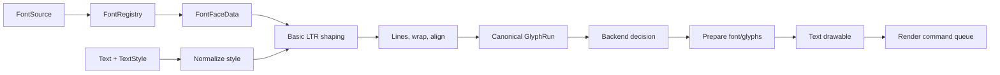

# Text System

## Objective

Provide one text/content/layout contract while allowing very different raster strategies:

- analytic outline coverage for extreme scaling;
- SDF for broad smooth-text compatibility;
- bitmap for crisp pixel fonts and icon atlases.

Widgets and layout must not know which strategy draws the glyphs.

## Pipeline



## Font source

v0.1 canonical sources:

```ts
type FontSource = URL | string | ArrayBuffer | Uint8Array | PreprocessedFontAsset;
```

Baseline outline formats are TTF/OTF when supported by the selected parser. WOFF/WOFF2 and variable-font behavior are not claimed until adapter-specific tests prove them.

Google Fonts is supported through host-supplied/self-hosted font files or bytes; the core does not parse CSS APIs or inject `@font-face`.

## Font data layers

### Registration metadata

Host-authored identity, backend preference, pixel policy, fallback chain, provenance, and license.

### Parsed face data

Metrics and outline access required by common layout/backends:

- units per em;
- ascender/descender/line gap;
- glyph mapping;
- advances;
- kerning;
- glyph bounds;
- optional outline extraction.

### Prepared backend font

Backend-owned GPU/atlas/parser state. A face may have prepared resources in multiple backends.

## FontRegistry lifecycle

States:

```text
registered → loading → ready
                   ↘ failed
ready → unregistering → disposed
```

Rules:

- concurrent equivalent requests deduplicate;
- caller-provided cache keys control identity when bytes/URLs are not sufficient;
- abort or unregister increments a generation;
- late results are disposed/ignored;
- parsed face and backend resources have separate owners;
- registry snapshots are read-only;
- no import-time font work.

## Text style normalization

Layout-affecting properties:

- font;
- size;
- letter spacing;
- line height;
- direction;
- wrap policy;
- max width/lines;
- overflow;
- text content.

Paint/backend-affecting properties:

- color;
- opacity;
- outline/shadow;
- backend preference;
- pixel policy.

Normalized defaults produce deterministic keys. Object identity is not part of a key.

## Basic v0.1 shaping/layout

The built-in path supports common left-to-right UI text:

1. iterate Unicode code points;
2. map code points to glyph IDs;
3. preserve cluster offsets;
4. apply advances;
5. apply pair kerning;
6. split explicit newlines;
7. wrap by word or character;
8. resolve line height;
9. align each line left/center/right;
10. emit immutable or mutation-safe line/glyph records.

It does not claim:

- Arabic joining;
- bidi reordering;
- Indic shaping;
- full ligature/feature control;
- grapheme-aware editing;
- vertical writing.

Unsupported text may still map glyphs visually, but the diagnostic and compatibility matrix must not claim linguistic correctness.

## Canonical GlyphRun

```ts
interface GlyphRun {
  font: FontHandle;
  direction: "ltr";
  glyphs: readonly {
    glyphId: number;
    cluster: number;
    x: number;
    y: number;
    advanceX: number;
    advanceY: number;
  }[];
  lines: readonly {
    startGlyph: number;
    glyphCount: number;
    baselineY: number;
    width: number;
    bounds: RectLike;
  }[];
  bounds: RectLike;
}
```

Fallback fonts split content into multiple runs while preserving line/cluster relationships.

## Backend decision

A decision receives:

- active renderer profile;
- font format/metadata;
- pixel policy;
- text style/effects;
- glyph count;
- clip requirements;
- explicit required/preferred backend;
- permission to use experimental backends.

Result:

```ts
type TextBackendDecision =
  | { status: "selected"; backendId: string; support: "ready" | "experimental" }
  | { status: "unsupported"; code: string; reason: string; alternatives: string[] }
  | { status: "pending"; reason: string };
```

`auto` is deterministic. It must not silently select an experimental backend unless explicitly permitted.

A suggested default order:

1. required backend, else fail;
2. crisp pixel font → bitmap if compatible;
3. allowed analytic backend on native WebGPU;
4. SDF compatibility backend;
5. bitmap smooth/fallback only if explicitly allowed;
6. visible unsupported diagnostic.

## Text drawable lifecycle

```text
GlyphRun + style
  → create drawable
  → paint-only patch
  → transform/clip patch
  → glyph-run replacement
  → release
```

Backends should avoid font/glyph preparation for paint-only updates. Changing `99` to `100` prepares only missing glyph IDs.

## Measurement cache

Cache input:

- font face/generation;
- normalized layout style;
- text;
- width/line constraints;
- shaping implementation/version.

Cache output:

- canonical run or measurement;
- hit/miss/eviction stats.

Cache is bounded by entry count and/or estimated bytes. Disposed font generations invalidate their entries.

## Fallback and missing glyphs

Fallback chain is explicit. Rules:

- detect cycles;
- prefer a replacement glyph when no fallback resolves;
- never index missing atlas data;
- deduplicate diagnostics by font/code-point range;
- omit full source text in normal diagnostics;
- document emoji/color-font limitations.

## Text effects

v0.1 effects are capability-based:

- fill color;
- opacity;
- optional outline;
- optional shadow.

A backend that cannot implement an effect reports unsupported or degrades only under an explicit policy. Effects must not create one material per label when a batchable parameter is possible.

## Pixel typography

A pixel font registration may contain:

```ts
pixel: {
  nativeSize: 11,
  allowedMultipliers: [1, 2, 3, 4],
  policy: 'crisp',
}
```

`nativeSize` describes intended raster design size. The same outline font may also be used in smooth analytic/SDF mode by choosing `policy: 'smooth'`.

Crisp bitmap presentation requires:

- bitmap preparation at native size;
- nearest filtering;
- integer multiplier;
- snapped origins, advances, line height, and clips;
- a layer/reference/DPR combination that satisfies the policy.

## Security and limits

Validate before expensive work:

- maximum font bytes;
- maximum glyph count per preparation request;
- maximum curves/rows/atlas area;
- maximum text length and lines;
- finite sizes and transforms;
- maximum backend buffers/pages.

Errors do not include full untrusted text or raw font bytes.

## No CSS dependency

The core does not require:

- `@font-face`;
- computed style;
- DOM measurement;
- canvas 2D text measurement for canonical layout;
- Google Fonts CSS API.

An optional runtime bitmap rasterizer may use browser canvas APIs after explicit invocation; it remains outside module evaluation and SSR-safe import.
