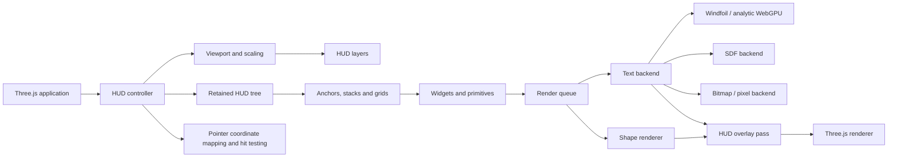

# Three.js Canvas HUD Library — Project Plan v0.1

## 1. Product definition

A retained-mode HUD/UI library for Three.js that renders entirely inside the graphics canvas, without HTML or CSS overlays.

Core proposition:

> A lightweight, design-oriented HUD toolkit for vanilla Three.js with logical screen coordinates, responsive/integer scaling, reusable game widgets, and pluggable text renderers for smooth vector-like fonts, SDF fonts, and pixel-perfect typography.

The project should focus on game HUDs and canvas-native interfaces rather than recreating the full browser layout model.

### Primary use cases

- Health, stamina, mana, ammunition, cooldown, and loading bars.
- Circular meters, radial progress, gauges, and segmented rings.
- Labels, counters, notifications, subtitles, and debug readouts.
- Inventory grids, item slots, selection frames, and hotbars.
- Crosshairs, targeting reticles, directional indicators, and markers.
- Menus and compact canvas-native control panels.
- Smooth UI fonts, Google Fonts loaded as local assets, and pixel fonts rendered without blur.

### Explicit non-goals for v0.1

- Full CSS compatibility.
- DOM accessibility parity.
- Rich text editing, IME, or text input fields.
- Complete Unicode shaping and bidirectional layout.
- World-space UI, XR panels, or diegetic interfaces.
- A general animation engine.
- A Figma-like editor.

---

## 2. Principal architectural decision

Do not make Windfoil the mandatory foundation of the library.

Windfoil should be integrated as an experimental high-quality WebGPU text backend behind a stable `TextBackend` interface. The core HUD, layout system, widgets, themes, and input system must remain independent of the selected text implementation.

Recommended renderer modes:

1. `analytic`: Windfoil-derived WebGPU backend for scalable outline text.
2. `sdf`: SDF backend for the broad WebGL-compatible baseline.
3. `bitmap`: pixel-perfect backend for pixel-art fonts and icon sheets.
4. `auto`: choose the best available mode based on font metadata and renderer capabilities.

This prevents the public API from being coupled to experimental WGSL integration and lets the library remain functional before the Windfoil backend is production-ready.

---

## 3. System architecture



### Main modules

| Module          | Responsibility                                                       |
| --------------- | -------------------------------------------------------------------- |
| `HUD`           | Lifecycle, renderer integration, update, render, resize, disposal.   |
| `HudViewport`   | Reference resolution, aspect handling, DPR, safe frame, global zoom. |
| `HudLayer`      | Independent scaling and render-order policy.                         |
| `HudNode`       | Transform, visibility, opacity, layout, children, dirty flags.       |
| `FontRegistry`  | Font loading, metadata, licenses, caches, backend selection.         |
| `TextBackend`   | Measurement, shaping/layout capability, glyph data, GPU drawables.   |
| `ShapeRenderer` | Rectangles, rounded rectangles, lines, rings, arcs, images.          |
| `LayoutEngine`  | Anchors, pivots, absolute positioning, stack, simple grid.           |
| `HitTester`     | Canvas pointer mapping, bounding boxes, event dispatch.              |
| `Theme`         | Typography, spacing, radii, colors, widget defaults.                 |

---

## 4. Coordinate and scaling model

The HUD should use logical design units rather than framebuffer pixels.

Example reference resolution:

```ts
referenceSize: [1920, 1080];
```

The renderer converts logical units into the current viewport using a layer-level scale policy.

### Required scale modes

| Mode      | Formula / behavior                    | Main use                                |
| --------- | ------------------------------------- | --------------------------------------- |
| `native`  | One HUD unit equals one CSS pixel.    | Debug overlays and fixed-size reticles. |
| `contain` | `min(viewportW/refW, viewportH/refH)` | Standard responsive HUD.                |
| `cover`   | `max(viewportW/refW, viewportH/refH)` | Full-bleed screens.                     |
| `integer` | Integer scale derived from `contain`. | Pixel-art UI.                           |
| `stretch` | Independent X/Y scale.                | Rare special effects; avoid for text.   |

The viewport must also calculate letterbox offsets, safe insets, and a separate user-controlled HUD zoom.

### Device-pixel snapping

For lines, icons, and pixel typography:

```ts
snapped = Math.round(logical * scale * dpr) / (scale * dpr);
```

Do not force continuous fonts and pixel fonts into the same scaling policy. Provide multiple layers:

```ts
const smoothLayer = hud.createLayer({ scaleMode: "contain" });
const pixelLayer = hud.createLayer({ scaleMode: "integer", pixelSnap: true });
const reticleLayer = hud.createLayer({ scaleMode: "native", pixelSnap: true });
```

This prevents Departure Mono and similar designs from becoming blurry when the responsive scale is fractional.

---

## 5. Text system

### Backend contract

```ts
export interface TextBackend {
  readonly id: string;
  readonly capabilities: TextBackendCapabilities;

  loadFont(source: FontSource, options?: FontLoadOptions): Promise<FontHandle>;
  measure(run: TextRun, constraints?: TextConstraints): TextMetrics;
  createDrawable(run: TextRun): TextDrawable;
  updateDrawable(drawable: TextDrawable, patch: TextPatch): void;
  disposeDrawable(drawable: TextDrawable): void;
  dispose(): void;
}

export interface TextBackendCapabilities {
  analyticScaling: boolean;
  multiline: boolean;
  kerning: boolean;
  shaping: "none" | "basic" | "full";
  bidi: boolean;
  pixelPerfect: boolean;
}
```

### Font registration

Fonts are loaded as URL, `ArrayBuffer`, or preprocessed asset. They are not registered through CSS.

```ts
await hud.fonts.register({
  id: "ui-sans",
  source: "/fonts/UiSans-Regular.ttf",
  renderMode: "auto",
});

await hud.fonts.register({
  id: "departure",
  source: "/fonts/DepartureMono-Regular.otf",
  renderMode: "bitmap",
  nativePixelSize: 11,
  allowedIntegerScales: [1, 2, 3, 4],
});
```

### Windfoil backend

The Windfoil adapter should reuse or port these stages:

1. Load and parse TTF/OTF outline data.
2. Convert glyph paths into quadratic curve data.
3. Split curves into monotonic segments where needed.
4. Build per-glyph row-band lookup tables.
5. Cache glyph geometry and metrics by font, variation, and glyph ID.
6. Upload curve and band data to storage/instanced GPU buffers.
7. Render one instanced quad per glyph.
8. Evaluate analytic coverage in WGSL.

The first implementation may deliberately support only:

- Left-to-right Latin text.
- Kerning and glyph advances.
- Newlines and library-owned wrapping.
- Static font instances rather than arbitrary variable-font axes.

Advanced shaping can later be delegated to HarfBuzz WASM while retaining the Windfoil raster backend.

### SDF backend

The baseline implementation can initially wrap Troika Three Text behind the library interface. This accelerates support for common font formats, kerning, ligatures, fallback fonts, and multiline text in WebGL projects.

Keep the wrapper optional and do not expose Troika classes through the public API. A future native MSDF/SDF implementation can replace it without breaking widgets.

### Bitmap backend

Pixel fonts require different rules:

- Rasterize or load at a known native size.
- Use nearest filtering.
- Allow integer scale only by default.
- Snap origin, line height, glyph advances, and clip rectangles to device pixels.
- Disable analytic smoothing unless explicitly requested.
- Support prebuilt bitmap sheets for fonts, icons, and controller glyphs.

---

## 6. Layout model

Do not implement Flexbox in v0.1.

Start with a small predictable layout system:

- Absolute X/Y position.
- Anchor presets: corners, edges, center.
- Pivot/origin.
- Margins and padding.
- Horizontal and vertical stack.
- Gap and alignment.
- Fixed-size grid.
- Content-sized nodes based on text or children.
- Min/max width and height.
- Rectangular clipping.

Example:

```ts
const panel = new Stack({
  direction: "column",
  gap: 8,
  padding: 12,
  width: 320,
});

panel.layout.anchor = "top-left";
panel.layout.offset.set(24, 24);
```

An optional Yoga adapter can be added after the widget API stabilizes. It should not be the core dependency.

---

## 7. Rendering primitives

### MVP primitives

- `Rect`
- `RoundedRect`
- `Line`
- `Image`
- `NineSlice`
- `Text`
- `Arc`
- `Ring`
- `ClipRect`

Rounded rectangles, rings, arcs, and crosshair forms should use signed-distance functions in fragment shaders where practical. This avoids excessive geometry and allows border, fill, feathering, and rounded corners to be controlled through uniforms or instance data.

### Render queue

Each visible node emits lightweight draw commands. The renderer groups commands by:

- Layer and z-index.
- Pipeline/material.
- Texture or font atlas.
- Blend mode.
- Clip region.

The MVP may begin with a modest number of meshes, but the public architecture should already allow replacement with instanced batches.

### Overlay pass

Default render sequence:

```ts
renderer.render(worldScene, worldCamera);
hud.render();
```

HUD defaults:

- `depthTest = false`
- `depthWrite = false`
- deterministic `zIndex`
- premultiplied-alpha-compatible blending
- no scene lighting

A later release can expose pre-postprocessing and post-postprocessing HUD layers.

---

## 8. Widgets for v0.1

| Widget          | Important properties                                           |
| --------------- | -------------------------------------------------------------- |
| `Label`         | Font, size, wrap, alignment, color, outline/shadow.            |
| `LinearBar`     | Value, min/max, orientation, border, fill direction, segments. |
| `RadialBar`     | Start angle, sweep, clockwise, thickness, caps, segments.      |
| `Gauge`         | Min/max, ticks, needle/value, labels.                          |
| `Crosshair`     | Gap, spread, thickness, ring, dot, dynamic recoil offset.      |
| `InventoryGrid` | Rows, columns, slot size, gap, selection, icons, quantity.     |
| `Hotbar`        | Slot list, selected index, keyboard/controller labels.         |
| `Panel`         | Background, border, padding, clipping.                         |
| `IconLabel`     | Icon plus aligned text/value.                                  |

Widgets should be compositions of primitives, not unique rendering systems.

---

## 9. Input model

The canvas supplies pointer events. The HUD converts viewport coordinates into each layer's logical coordinate system and performs front-to-back hit testing against layout bounds.

Minimal event set:

- `pointerenter`
- `pointerleave`
- `pointermove`
- `pointerdown`
- `pointerup`
- `click`
- `focus` and `blur` later

The initial system does not need Three.js raycasting because screen-space elements have known rectangles. Alpha-aware hit testing can be added only for components that need it.

---

## 10. Public API sketch

```ts
import { HUD, Label, LinearBar, RadialBar, Crosshair, InventoryGrid } from "@scope/three-hud";

const hud = new HUD({
  renderer,
  referenceSize: [1920, 1080],
  scaleMode: "contain",
  textBackend: "auto",
});

await hud.fonts.register({
  id: "interface",
  source: "/fonts/Interface-Regular.ttf",
  renderMode: "analytic",
});

await hud.fonts.register({
  id: "pixel",
  source: "/fonts/DepartureMono-Regular.otf",
  renderMode: "bitmap",
  nativePixelSize: 11,
});

const health = new LinearBar({
  size: [360, 24],
  value: 0.72,
  min: 0,
  max: 1,
  radius: 4,
});

health.layout.anchor = "top-left";
health.layout.offset.set(32, 32);

health.add(
  new Label({
    text: "HP 72 / 100",
    font: "pixel",
    fontSize: 22,
  }),
);

hud.root.add(health);
hud.root.add(new Crosshair({ anchor: "center", gap: 6 }));

function frame(dt: number) {
  health.value = player.health / player.maxHealth;
  hud.update(dt);

  renderer.render(scene, camera);
  hud.render();
}
```

The animation API should remain external-friendly. Mutable numeric properties can be animated with GSAP, custom tweening, or the game engine loop. The library only needs optional convenience interpolation.

---

## 11. Suggested repository structure

```text
three-hud/
├─ src/
│  ├─ core/
│  │  ├─ HUD.ts
│  │  ├─ HudNode.ts
│  │  ├─ HudLayer.ts
│  │  ├─ HudViewport.ts
│  │  ├─ DirtyFlags.ts
│  │  └─ types.ts
│  ├─ layout/
│  │  ├─ anchors.ts
│  │  ├─ Stack.ts
│  │  ├─ Grid.ts
│  │  └─ layoutNode.ts
│  ├─ render/
│  │  ├─ HudPass.ts
│  │  ├─ RenderQueue.ts
│  │  ├─ ShapeRenderer.ts
│  │  └─ shaders/
│  ├─ text/
│  │  ├─ TextBackend.ts
│  │  ├─ FontRegistry.ts
│  │  ├─ windfoil/
│  │  ├─ sdf/
│  │  └─ bitmap/
│  ├─ primitives/
│  │  ├─ Rect.ts
│  │  ├─ Image.ts
│  │  ├─ Arc.ts
│  │  ├─ Ring.ts
│  │  └─ Text.ts
│  ├─ widgets/
│  │  ├─ LinearBar.ts
│  │  ├─ RadialBar.ts
│  │  ├─ Gauge.ts
│  │  ├─ Crosshair.ts
│  │  ├─ InventoryGrid.ts
│  │  └─ Hotbar.ts
│  ├─ input/
│  │  ├─ HitTester.ts
│  │  └─ HudPointerEvent.ts
│  └─ theme/
│     ├─ Theme.ts
│     └─ tokens.ts
├─ examples/
│  ├─ hud-showcase/
│  ├─ typography-lab/
│  ├─ scaling-lab/
│  ├─ inventory/
│  └─ windfoil-spike/
├─ tests/
│  ├─ unit/
│  └─ visual/
├─ THIRD_PARTY_NOTICES.md
├─ LICENSE
└─ README.md
```

Keep this as one package initially. Expose optional adapters through subpath exports rather than creating a monorepo prematurely:

```json
{
  "exports": {
    ".": "./dist/index.js",
    "./text/troika": "./dist/text/troika.js",
    "./text/windfoil": "./dist/text/windfoil.js",
    "./text/bitmap": "./dist/text/bitmap.js"
  }
}
```

---

## 12. Implementation roadmap

### P0 — Windfoil integration spike

Build only enough to answer whether the technique can be cleanly hosted inside Three.js.

Deliverables:

- Load one local TTF.
- Render one line of text through a Three.js WebGPU render path.
- Use instanced glyph quads and storage buffers.
- Resize correctly at DPR 1, 2, and 3.
- Zoom from small UI text to extreme close-up.
- Test opacity, color, transforms, and clipping.
- Avoid patching private Three.js internals.
- Record GPU/CPU timings and limitations.

Gate:

> If Windfoil requires brittle renderer internals or cannot coexist with the normal Three render flow, keep it in a separate experimental adapter and ship the initial library with SDF plus bitmap text.

### P1 — Core and scaling laboratory

- HUD lifecycle.
- Orthographic overlay scene/camera.
- Logical viewport and scale modes.
- Layers, anchors, pivot, safe frame.
- Dirty flags and disposal.
- Interactive scaling demo.

### P2 — Primitives and render queue

- Rect, rounded rect, line, image, arc, ring.
- z-index and clipping.
- Render queue and material reuse.
- Basic instancing where measurable.

### P3 — Text abstraction

- Font registry.
- Text measurement contract.
- Troika/SDF adapter.
- Bitmap/pixel adapter.
- Text wrapping and alignment.
- Windfoil adapter plugged into the same contract.

### P4 — Widgets and interaction

- Bars, radial progress, crosshair, gauge.
- Inventory grid and hotbar.
- Pointer mapping and click/hover states.
- Theme tokens and widget variants.

### P5 — Release hardening

- API review and naming consistency.
- Visual regression tests.
- Performance benchmark scene.
- Documentation and examples.
- Package exports and tree shaking.
- License notices.
- `0.1.0` release.

---

## 13. Vertical-slice demo

The first complete showcase should contain:

- Top-left health and stamina bars.
- Smooth-font labels and numbers.
- Center native-scale crosshair.
- Bottom-right radial cooldown meter.
- Bottom-center eight-slot inventory hotbar.
- One pixel-font layer using integer scaling.
- Controls for viewport size, DPR, HUD zoom, text backend, and font.
- A debug overlay showing draw calls, glyph count, shapes, active clips, and dirty updates.

This one scene tests nearly every foundational decision without requiring a game.

---

## 14. Acceptance criteria for v0.1

### Visual

- Correct anchors at 16:9, 16:10, ultrawide, and portrait test sizes.
- No half-pixel drift in pixel layers.
- Stable clipping and z-order.
- Smooth fonts remain legible through the supported zoom range.
- Pixel fonts stay hard-edged at integer scales.

### Functional

- Runtime font loading from URL and `ArrayBuffer`.
- Bars, rings, crosshair, labels, and inventory grid update without rebuilding the whole HUD.
- Pointer hit testing remains correct after resize and scaling.
- All resources dispose cleanly.

### Performance targets

Treat these as engineering targets, not promises:

- No recurring JavaScript allocations in steady-state rendering after warm-up.
- Updating a value changes instance/uniform data rather than recreating geometry.
- A stress test with roughly 100 shape primitives and 1,000–2,000 visible glyphs remains interactive on a representative mid-range GPU.
- Static HUD frames should skip layout and text rebuilds through dirty flags.

### Quality

- Unit tests for scale modes, anchors, grid, pointer transforms, and text wrapping.
- Fixed-DPR Playwright screenshots for visual regression.
- One benchmark page for each text backend.
- No backend-specific types leaking into widget APIs.

---

## 15. Risks and mitigations

| Risk                                                                   | Consequence                                        | Mitigation                                                                        |
| ---------------------------------------------------------------------- | -------------------------------------------------- | --------------------------------------------------------------------------------- |
| Windfoil is a demo/algorithm rather than a packaged Three.js renderer. | Integration takes longer than the rest of the HUD. | Risk-first spike; isolate behind `TextBackend`.                                   |
| Three.js WebGPU APIs evolve.                                           | Shader/buffer integration may break on upgrade.    | Pin tested Three versions; use public TSL/storage APIs; avoid renderer internals. |
| Windfoil lacks general shaping/layout.                                 | Complex scripts and bidirectional text fail.       | Declare Latin LTR scope in v0.1; add HarfBuzz later.                              |
| Continuous responsive scaling blurs pixel fonts.                       | Pixel UI loses its aesthetic.                      | Dedicated integer-scaled `HudLayer`; device-pixel snapping.                       |
| Too many meshes and materials.                                         | Draw-call pressure.                                | Render queue, material reuse, glyph instancing, later shape batching.             |
| Full CSS-like layout expands scope.                                    | Project becomes another general UI framework.      | Limit v0.1 to anchors, stacks, grid, and clipping.                                |
| Font licensing is inconsistent.                                        | Distribution/legal problems.                       | Do not bundle fonts by default; preserve each license and notices.                |

---

## 16. Licensing policy

Recommended policy:

- License the library itself under MIT unless Apache-2.0 compatibility or patent language is deliberately preferred.
- When adapting Windfoil code, retain the Apache-2.0 license, attribution, and notices for the adapted files.
- Add a `THIRD_PARTY_NOTICES.md` file.
- Do not bundle third-party fonts by default.
- Each example font must include its license file and source metadata.
- Store font license metadata in `FontRegistry` only for auditing; do not pretend it replaces the original license file.
- Verify every MEK font release individually before redistributing it.

Suggested asset layout:

```text
examples/assets/fonts/<font-family>/
├─ FontFile.ttf
├─ LICENSE.txt
└─ SOURCE.md
```

---

## 17. Recommended starting strategy

Use a portable-first product architecture with a Windfoil-first technical investigation:

1. Perform the Windfoil/Three WebGPU spike before freezing the text API.
2. Define the renderer-independent HUD tree, viewport, and `TextBackend` interface.
3. Ship SDF and bitmap implementations as the reliable baseline.
4. Add Windfoil as an opt-in analytic backend once it passes the spike gate.
5. Keep the product focused on HUD widgets, responsive layers, pixel-art modes, and visual authoring—not general browser UI replacement.

The first engineering artifact should be the `scaling-lab` plus `windfoil-spike`, not the inventory widget. Those two experiments determine whether the rest of the architecture is sound.
